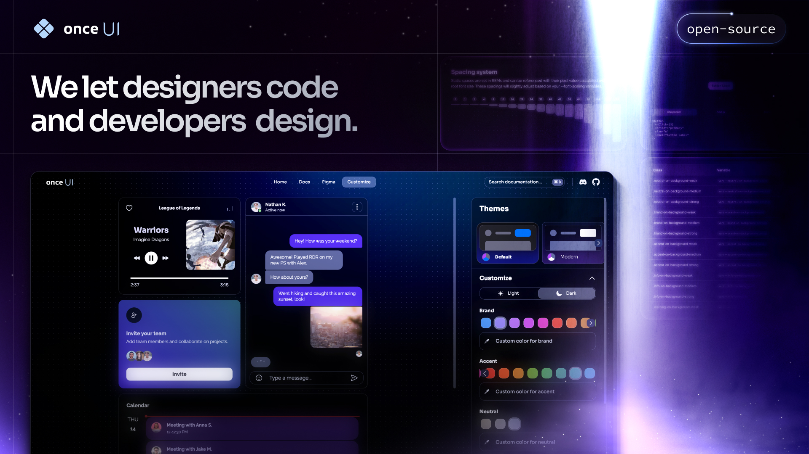

# **Once UI for Next.js**

<span style="font-size: 22px;">Once UI is a lightweight, versatile design system with easy customization and practical components.
<br>



<span style="font-size: 18px;">Start building your Next.js app in minutes with:</span> 
* **A robust token and style system** that simplifies customization and ensures consistency. 
* **A copy-and-paste component library** that integrates seamlessly into your project.
* **Interactive documentation** to apply your branding and set component properties.
<br><br>

# **Documentation**
The documentation is available at [once-ui.com/docs](https://once-ui.com/docs).
<br><br>

# **Authors**
Connect with us!

Lorant One: [Site](https://lorant.one), [Threads](https://www.threads.net/@lorant.one), [LinkedIn](https://www.linkedin.com/in/lorant-one/)  
Zsofia Komaromi: [Site](https://zsofia.pro), [Threads](https://www.threads.net/@zsofia_kom), [LinkedIn](https://www.linkedin.com/in/zsofiakomaromi/)
<br><br>

# **Get involved**
- Join the [Design Engineers Club](https://discord.com/invite/5EyAQ4eNdS) on Discord to connect with designers, developers and share your projects.
- Report a [bug](https://github.com/once-ui-system/nextjs-starter/issues/new?labels=bug&template=bug_report.md).
- Submit a [feature request](https://github.com/once-ui-system/nextjs-starter/issues/new?labels=feature%20request&template=feature_request.md).
<br><br>

# **License**

Distributed under the MIT License. See `LICENSE.txt` for more information.
<br><br>

# **Once UI for Figma**

Once UI is also available for Figma.  
Design and prototype entire products from scratch in hours. Use the same tokens and components as the Next.js design system.

Grab a copy from the [Figma Community](https://figma.com/).
<br><br>

# **Deploy your project**

[](https://railway.app/template/76DR9Q?referralCode=QW2HBC)

[](https://vercel.com/new/clone?repository-url=https%3A%2F%2Fgithub.com%2Fonce-ui-system%2Fnextjs-starter&redirect-url=https%3A%2F%2Fonce-ui.com%2Fdocs%2F)

<div align="center">
  
  <h1>Sanchay Shetty - Portfolio</h1>
  <p>Frontend Developer | Final Year Undergraduate at PES University</p>
</div>

## 🚀 About Me

Frontend Developer with a passion for creating intuitive and performant web applications. Currently pursuing my final year at PES University, specializing in web development with modern technologies.

## 💻 Tech Stack

- **Frontend**: React.js, Next.js, TypeScript
- **Styling**: Tailwind CSS, CSS3
- **Version Control**: Git, GitHub
- **Tools**: VS Code, Figma

## 🌟 Key Features

- Modern UI/UX with responsive design
- Server-side rendering with Next.js
- Type-safe development using TypeScript
- Component-based architecture
- Performance optimized

## 🛠️ Installation & Setup

```bash
# Clone the repository
git clone https://github.com/yourusername/portfolio.git

# Navigate to project directory
cd portfolio

# Install dependencies
npm install

# Start development server
npm run dev
```

## 🔗 Links

- [Live Portfolio](https://your-portfolio-url.com)
- [LinkedIn](https://linkedin.com/in/your-profile)
- [GitHub](https://github.com/your-username)

## 📝 License

This project is open source and available under the [MIT License](LICENSE).

## 📧 Contact

- Email: your.email@example.com
- LinkedIn: [Sanchay Shetty](https://linkedin.com/in/your-profile)
